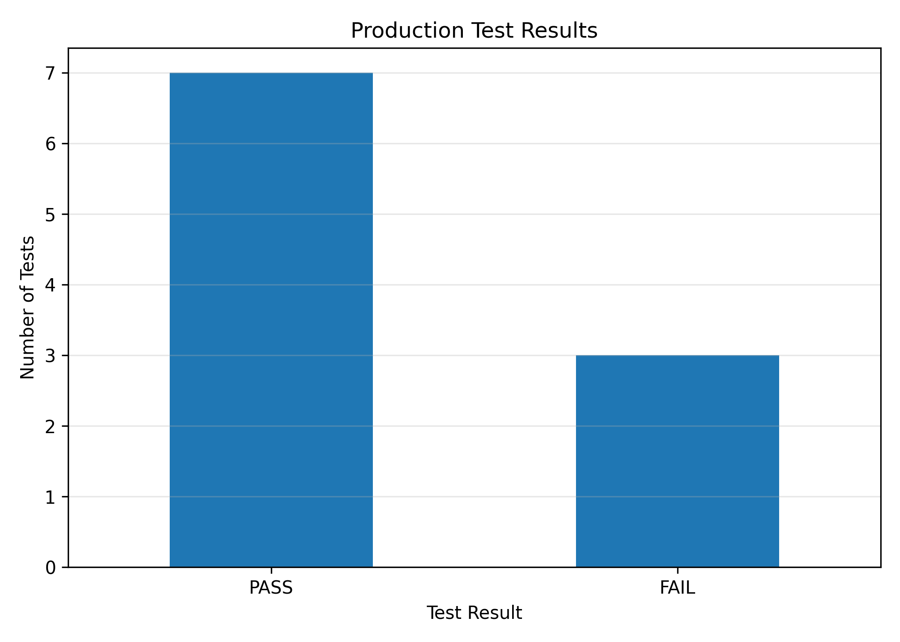
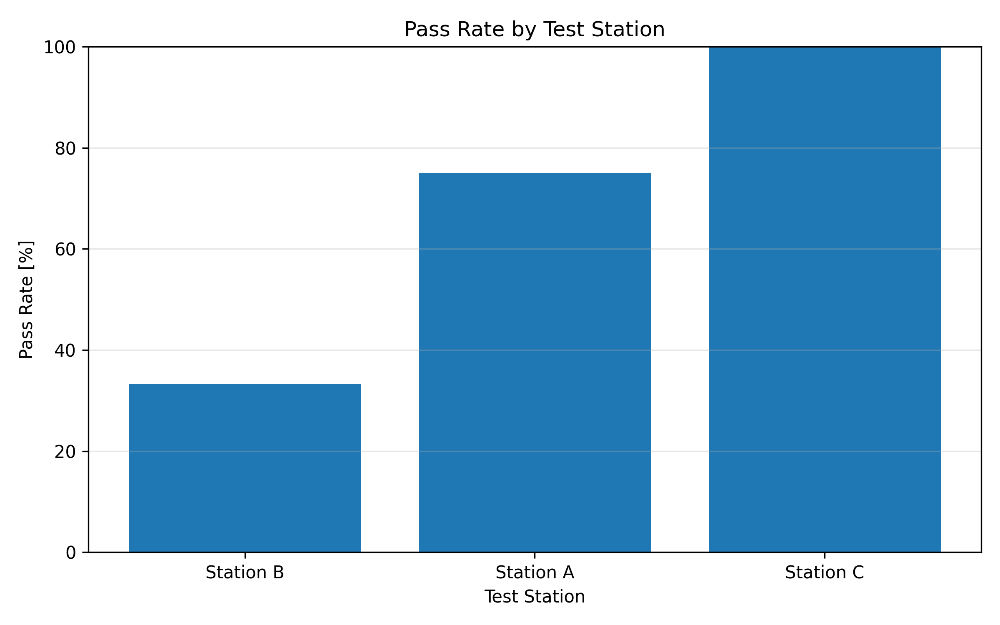

# Production Data Analysis with Python and SQL

## Overview

This project analyzes production test data using Python and SQL.

It creates a SQLite database, reads sample production measurements from a CSV file, runs SQL queries, detects failed products, calculates pass/fail rates, evaluates test station performance, creates charts, and generates an automated text report.

The project is inspired by industrial production and quality-control use cases, such as production testing, process data evaluation, and technical quality monitoring.

## Technologies Used

- Python
- SQLite
- SQL
- pandas
- matplotlib
- CSV data handling

## Features

- Reads production test data from a CSV input file
- Creates a SQLite database for production test data
- Stores sample measurements such as temperature, voltage, current, and test duration
- Uses SQL queries to analyze failed products and station performance
- Calculates pass rate, fail rate, average values, and limit violations
- Detects possible failure reasons based on engineering limits
- Creates charts for production test results and pass rate by station
- Generates an automated text report

## Project Structure

```text
production-data-analysis-sql-python/
│
├── main.py
├── sample_production_data.csv
├── README.md
├── requirements.txt
├── .gitignore
├── screenshots/
│   ├── pass_fail_chart.png
│   └── station_pass_rate_chart.png
└── outputs/
    ├── production_report.txt
    ├── pass_fail_chart.png
    └── station_pass_rate_chart.png
```

## Input Data

The project uses a CSV file named:

```text
sample_production_data.csv
```

The dataset contains simulated production test measurements.

| Column | Description |
|---|---|
| `product_id` | Product identification number |
| `test_station` | Production test station |
| `temperature_c` | Measured temperature in degrees Celsius |
| `voltage_v` | Measured voltage in volts |
| `current_a` | Measured current in amperes |
| `test_duration_s` | Test duration in seconds |
| `test_result` | Final test result: PASS or FAIL |

## Analysis Logic

### SQL Database

The program creates a SQLite database named:

```text
production_data.db
```

The production test data is inserted into a database table called:

```text
production_tests
```

### SQL Queries

The program uses SQL queries to analyze:

- failed products
- total tests by station
- passed and failed tests by station
- average temperature by station
- average voltage by station
- average current by station
- pass rate by station

### Quality-Control Logic

The program uses simple engineering limits to detect possible failure reasons:

| Condition | Limit |
|---|---|
| High temperature | `temperature_c > 90.0` |
| Low voltage | `voltage_v < 11.8` |
| High current | `current_a > 2.4` |

## How to Run

Clone the repository:

```bash
git clone https://github.com/amrshehata23/production-data-analysis-sql-python.git
```

Open the project folder:

```bash
cd production-data-analysis-sql-python
```

Install the required libraries:

```bash
pip install -r requirements.txt
```

Run the program:

```bash
python main.py
```

Expected terminal output:

```text
Project finished successfully.
Database created: production_data.db
Report created: outputs/production_report.txt
Charts created in: outputs
```

## Output Files

After running the project, the program creates:

- `production_data.db`
- `outputs/production_report.txt`
- `outputs/pass_fail_chart.png`
- `outputs/station_pass_rate_chart.png`

## Example Output

### Production Test Results



### Pass Rate by Test Station



## Example Analysis

The program analyzes production test results and answers questions such as:

- How many products passed or failed?
- Which test station has the lowest pass rate?
- Which products failed the test?
- Were there abnormal temperature, voltage, or current values?
- What are the average measurement values?
- Which production station has the highest number of failed tests?

## Skills Demonstrated

- Python programming
- SQL database creation
- SQLite database handling
- SQL querying
- CSV data processing
- Data analysis with pandas
- Basic quality-control logic
- Data visualization with matplotlib
- Automated report generation
- Clean Python project structure

## What I Learned

- How to create and use a SQLite database with Python
- How to import production test data from a CSV file
- How to write SQL queries for engineering data analysis
- How to calculate production quality metrics
- How to detect abnormal measurement values
- How to generate plots and automated reports with Python

## Possible Applications

- Production data analysis
- Quality control
- Test station performance evaluation
- Manufacturing process monitoring
- Engineering data analysis
- Internship portfolio project for automotive and industrial companies

## Future Improvements

- Add more production test data
- Import larger datasets
- Add trend analysis over time
- Build a dashboard for visualizing production quality
- Add PDF report generation
- Extend the project with cloud basics such as AWS or Azure
- Explore KQL and PySpark for larger datasets

## Project Status

This project was created as a Python and SQL engineering portfolio project focused on production data analysis, quality-control logic, visualization, and automated reporting.
